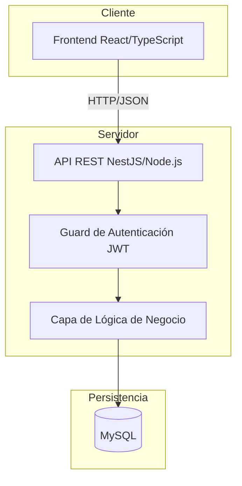
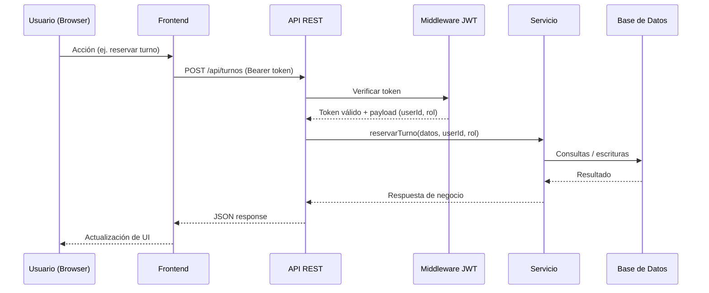
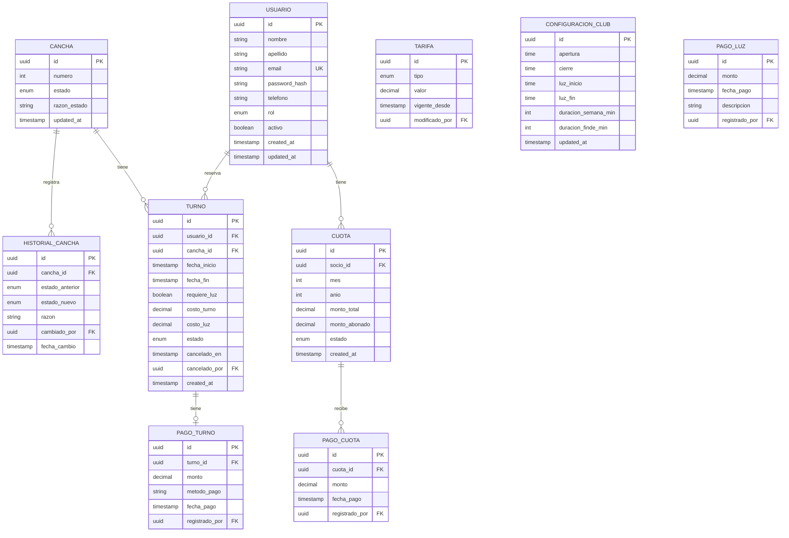

# Documento de Diseño Técnico — Gestión Club de Tenis

## Descripción General

El sistema de gestión del Club de Tenis es una aplicación web de tres capas que reemplaza los procesos manuales (WhatsApp y planillas Excel) por una plataforma centralizada. Permite administrar socios, reservas de canchas, pagos de cuotas, tarifas y estadísticas operativas.

El sistema atiende tres tipos de usuarios: Administrador, Socio y No_Socio. Cada rol tiene acceso diferenciado a las funcionalidades. La aplicación debe funcionar correctamente en dispositivos móviles, tablets y escritorio.

**Tecnologías propuestas:**
- Frontend: React + TypeScript (SPA responsiva)
- Backend: Node.js + NestJS (API REST)
- Base de datos: MySQL
- Autenticación: JWT (JSON Web Tokens)
- ORM: TypeORM

---

## Arquitectura

El sistema sigue una arquitectura de tres capas clásica con separación clara de responsabilidades:



### Flujo de una solicitud típica



---

## Componentes e Interfaces

### Frontend

| Módulo | Descripción |
|---|---|
| `AuthModule` | Registro, login, logout |
| `UsuariosModule` | Listado, búsqueda, filtros, edición de usuarios (Admin) |
| `CanchasModule` | Gestión de estado de canchas (Admin) |
| `TurnosModule` | Reserva, cancelación, consulta de turnos |
| `CuotasModule` | Gestión y consulta de cuotas de socios |
| `TarifasModule` | Configuración de tarifas y franjas horarias (Admin) |
| `PagosModule` | Registro de pagos de turnos y luz |
| `EstadisticasModule` | Panel de estadísticas generales y financieras (Admin) |

### API REST — Endpoints principales

#### Autenticación
```
POST   /api/auth/register
POST   /api/auth/login
POST   /api/auth/logout
```

#### Usuarios
```
GET    /api/usuarios              (Admin)
GET    /api/usuarios/:id
PUT    /api/usuarios/:id
PATCH  /api/usuarios/:id/rol      (Admin)
DELETE /api/usuarios/:id          (Admin — baja lógica)
```

#### Canchas
```
GET    /api/canchas
PATCH  /api/canchas/:id/estado    (Admin)
GET    /api/canchas/:id/historial (Admin)
```

#### Turnos
```
GET    /api/turnos                (Admin: todos; Usuario: propios)
POST   /api/turnos
DELETE /api/turnos/:id
GET    /api/turnos/historial      (Socio: propios; Admin: todos)
```

#### Cuotas
```
GET    /api/cuotas                (Admin: todas; Socio: propias)
POST   /api/cuotas/:id/pagos      (Admin)
```

#### Tarifas
```
GET    /api/tarifas
PUT    /api/tarifas/:tipo         (Admin)
GET    /api/tarifas/historial     (Admin)
```

#### Pagos de luz
```
POST   /api/pagos-luz             (Admin)
GET    /api/pagos-luz             (Admin)
```

#### Estadísticas
```
GET    /api/estadisticas/generales    (Admin)
GET    /api/estadisticas/financieras  (Admin)
```

### Middleware

- **JwtAuthGuard**: Guard de NestJS que verifica el JWT en el header `Authorization: Bearer <token>`. Rechaza con 401 si el token es inválido o expirado.
- **RolesGuard**: Guard de NestJS que verifica que el rol del usuario autenticado esté en la lista permitida (decorador `@Roles()`). Rechaza con 403 si no tiene permisos.
- **OwnerOrAdminGuard**: Verifica que el recurso solicitado pertenezca al usuario autenticado o que sea Administrador.

---

## Modelos de Datos

### Diagrama Entidad-Relación



### Enumeraciones

```typescript
enum Rol { ADMINISTRADOR = 'administrador', SOCIO = 'socio', NO_SOCIO = 'no_socio' }
enum EstadoCancha { DISPONIBLE = 'disponible', MANTENIMIENTO = 'mantenimiento', INHABILITADA = 'inhabilitada' }
enum EstadoTurno { ACTIVO = 'activo', CANCELADO = 'cancelado' }
enum EstadoCuota { PENDIENTE = 'pendiente', PARCIAL = 'parcialmente_pagada', PAGADA = 'pagada' }
enum TipoTarifa { TURNO_NO_SOCIO = 'turno_no_socio', LUZ = 'luz', CUOTA = 'cuota' }
```

### Reglas de negocio clave en la capa de servicio

1. **Límite diario de turnos**: Un usuario no-administrador puede reservar máximo 2 turnos por día.
2. **Anticipación máxima**: Solo se puede reservar con hasta 1 día de anticipación.
3. **Bloqueo por deuda**: Un Socio con 2 o más cuotas impagas solo puede reservar 1 turno adicional.
4. **Duración de turno**: 60 min en días de semana, 90 min en fines de semana y feriados.
5. **Cargo de luz**: Se aplica si el turno cae dentro de la franja horaria de iluminación configurada.
6. **Cancelación**: Solo se permite con al menos 1 hora de anticipación al inicio del turno.
7. **Tarifa vigente**: Se aplica la tarifa activa al momento de la reserva (snapshot del valor).
8. **Generación de cuotas**: Se ejecuta automáticamente al inicio de cada mes para todos los socios activos.


---

## Propiedades de Corrección

*Una propiedad es una característica o comportamiento que debe mantenerse verdadero en todas las ejecuciones válidas del sistema — esencialmente, una declaración formal sobre lo que el sistema debe hacer. Las propiedades sirven como puente entre las especificaciones legibles por humanos y las garantías de corrección verificables automáticamente.*

---

### Propiedad 1: Registro con datos válidos crea usuario con rol No_Socio

*Para cualquier* conjunto de datos de registro válidos (nombre, apellido, correo único, contraseña, teléfono), el sistema debe crear el usuario exitosamente y asignarle el rol No_Socio por defecto.

**Valida: Requerimientos 1.1, 1.3**

---

### Propiedad 2: Correo duplicado rechaza el registro

*Para cualquier* correo electrónico ya registrado en el sistema, un intento de registro con ese mismo correo debe ser rechazado sin crear un nuevo usuario.

**Valida: Requerimiento 1.2**

---

### Propiedad 3: Campos obligatorios vacíos rechazan el registro

*Para cualquier* combinación de campos obligatorios faltantes o vacíos en el formulario de registro, el sistema debe rechazar la solicitud sin crear ningún usuario.

**Valida: Requerimiento 1.4**

---

### Propiedad 4: Credenciales válidas generan sesión autenticada

*Para cualquier* usuario activo registrado, ingresar su correo y contraseña correctos debe devolver un token JWT válido que permita acceder a los endpoints protegidos.

**Valida: Requerimientos 2.1, 2.3**

---

### Propiedad 5: Credenciales inválidas rechazan el acceso

*Para cualquier* combinación de credenciales incorrectas (correo inexistente, contraseña incorrecta, o usuario inactivo), el sistema debe rechazar el acceso con un mensaje genérico sin revelar cuál campo es incorrecto.

**Valida: Requerimientos 2.2, 3.7**

---

### Propiedad 6: Logout invalida el token

*Para cualquier* sesión activa, después de ejecutar el logout, el token previamente emitido no debe ser aceptado por ningún endpoint protegido.

**Valida: Requerimiento 2.4**

---

### Propiedad 7: Endpoints protegidos requieren autenticación

*Para cualquier* endpoint protegido de la API, una solicitud sin token o con token inválido debe ser rechazada con código 401.

**Valida: Requerimientos 2.5, 15.4**

---

### Propiedad 8: Control de acceso por rol

*Para cualquier* endpoint restringido a un rol específico (ej. administración), una solicitud de un usuario con rol insuficiente debe ser rechazada con código 403. Esto aplica tanto a funcionalidades de administración como a la consulta de recursos ajenos.

**Valida: Requerimientos 15.1, 15.2, 15.3**

---

### Propiedad 9: Cambio de rol persiste y no puede ser auto-aplicado

*Para cualquier* usuario y rol válido, un Administrador puede cambiar el rol de otro usuario y el cambio debe persistir. Sin embargo, ningún usuario puede cambiar su propio rol.

**Valida: Requerimientos 3.1, 3.2**

---

### Propiedad 10: Actualización de datos personales no altera el rol

*Para cualquier* usuario (Socio o No_Socio) que actualice su información personal (nombre, teléfono, contraseña), el rol y el estado del usuario deben permanecer invariantes después de la actualización.

**Valida: Requerimientos 3.3, 3.4**

---

### Propiedad 11: Baja lógica conserva el historial

*Para cualquier* usuario dado de baja, el registro debe permanecer en la base de datos marcado como inactivo, y todos sus datos históricos (turnos, cuotas) deben seguir siendo accesibles para el Administrador.

**Valida: Requerimiento 3.5**

---

### Propiedad 12: Filtros de listado devuelven solo resultados coincidentes

*Para cualquier* listado (usuarios, turnos, cuotas) con un filtro aplicado (por nombre/apellido, estado, rol, fecha), todos los resultados devueltos deben cumplir el criterio del filtro, y ningún resultado que no cumpla el criterio debe aparecer.

**Valida: Requerimientos 4.2, 4.3, 4.4, 8.2, 8.3, 9.6, 9.7, 9.8, 10.6**

---

### Propiedad 13: Listados incluyen todos los campos requeridos

*Para cualquier* elemento en un listado (usuario, turno, cuota), la respuesta debe incluir todos los campos especificados en los requerimientos para ese listado.

**Valida: Requerimientos 4.1, 8.1, 9.5, 12.3**

---

### Propiedad 14: Cambio de estado de cancha bloquea reservas

*Para cualquier* cancha con estado distinto a "disponible", cualquier intento de reserva en esa cancha debe ser rechazado. El historial de cambios de estado debe conservar todos los cambios realizados.

**Valida: Requerimientos 5.1, 5.2, 5.3**

---

### Propiedad 15: Conflicto de horario rechaza la reserva

*Para cualquier* par de turnos que se solapen en la misma cancha y horario, el segundo intento de reserva debe ser rechazado.

**Valida: Requerimiento 6.1**

---

### Propiedad 16: Cargo de luz según franja horaria

*Para cualquier* turno, si su horario cae dentro de la franja de iluminación configurada, el campo costo_luz debe ser mayor a 0; si cae fuera de esa franja, el costo_luz debe ser 0.

**Valida: Requerimientos 6.2, 6.3, 6.4**

---

### Propiedad 17: Duración de turno según tipo de día

*Para cualquier* turno reservado, la duración debe ser de 60 minutos si corresponde a un día de semana, y de 90 minutos si corresponde a fin de semana o feriado.

**Valida: Requerimiento 6.5**

---

### Propiedad 18: Reservas fuera del horario de funcionamiento son rechazadas

*Para cualquier* intento de reserva con horario fuera del rango de funcionamiento configurado (por defecto 8:00–22:00), el sistema debe rechazar la solicitud.

**Valida: Requerimiento 6.6**

---

### Propiedad 19: Límite diario de turnos por usuario no-administrador

*Para cualquier* usuario con rol Socio o No_Socio que ya tenga 2 turnos reservados en un día, cualquier intento de reservar un tercer turno en ese mismo día debe ser rechazado. Los Administradores no tienen esta restricción.

**Valida: Requerimientos 6.7, 6.11**

---

### Propiedad 20: Restricción de anticipación máxima de reserva

*Para cualquier* intento de reserva con fecha de inicio a más de 1 día de anticipación desde el momento actual, el sistema debe rechazar la solicitud.

**Valida: Requerimiento 6.8**

---

### Propiedad 21: Bloqueo de reservas por deuda de cuotas

*Para cualquier* Socio con 2 o más cuotas impagas, el sistema debe permitir exactamente 1 turno adicional y rechazar cualquier reserva posterior hasta que regularice su deuda.

**Valida: Requerimiento 6.9**

---

### Propiedad 22: Cancelación según anticipación

*Para cualquier* turno, si se intenta cancelar con al menos 1 hora de anticipación, la cancelación debe ser exitosa y la cancha debe quedar disponible. Si se intenta con menos de 1 hora de anticipación, debe ser rechazada. En ambos casos, el intento debe quedar registrado con fecha, hora y usuario.

**Valida: Requerimientos 7.1, 7.2, 7.3**

---

### Propiedad 23: Aislamiento de datos entre usuarios no-administradores

*Para cualquier* usuario con rol Socio o No_Socio, el listado de sus turnos vigentes y su historial no debe contener turnos ni cuotas pertenecientes a otros usuarios.

**Valida: Requerimientos 8.4, 8.5, 9.9**

---

### Propiedad 24: Generación de cuotas cubre todos los socios activos

*Para cualquier* ejecución del proceso de generación mensual de cuotas, todos los socios activos en ese momento deben tener exactamente una cuota generada para el mes en curso, y ningún socio inactivo debe recibir cuota.

**Valida: Requerimiento 9.1**

---

### Propiedad 25: Estado de cuota refleja la suma de pagos parciales

*Para cualquier* cuota, si la suma de todos sus pagos parciales es menor al monto total, el estado debe ser PENDIENTE o PARCIAL. Si la suma iguala o supera el monto total, el estado debe ser PAGADA.

**Valida: Requerimientos 9.2, 9.3, 9.4**

---

### Propiedad 26: Modificación de tarifa conserva historial y actualiza vigente

*Para cualquier* tipo de tarifa (turno No_Socio, luz, cuota mensual), al modificar su valor, el nuevo valor debe quedar como vigente con la fecha de modificación, y el valor anterior debe permanecer en el historial. La consulta de tarifas vigentes debe devolver siempre el valor más reciente de cada tipo.

**Valida: Requerimientos 10.1, 10.2, 10.3, 10.4, 10.5**

---

### Propiedad 27: Snapshot de tarifa al momento de la reserva

*Para cualquier* turno reservado, el costo registrado debe corresponder a la tarifa vigente en el momento exacto de la reserva, independientemente de cambios de tarifa posteriores.

**Valida: Requerimiento 10.7**

---

### Propiedad 28: Configuración del club se aplica a nuevas reservas

*Para cualquier* modificación de la configuración del club (franja horaria, franja de luz, duración de turnos), las nuevas reservas deben validarse y calcularse según la configuración vigente en el momento de la reserva.

**Valida: Requerimientos 11.1, 11.2, 11.3, 11.4, 11.5**

---

### Propiedad 29: Pagos de turnos y luz quedan asociados correctamente

*Para cualquier* pago de turno o de luz registrado por un Administrador, el pago debe quedar asociado al turno correspondiente con todos los campos requeridos (monto, fecha, método de pago).

**Valida: Requerimientos 12.1, 12.2, 13.1**

---

### Propiedad 30: Estadísticas son consistentes con los datos subyacentes

*Para cualquier* período seleccionado, los totales y conteos mostrados en el panel de estadísticas deben ser iguales a la suma/conteo de los registros correspondientes en la base de datos para ese período. Ningún indicador debe incluir datos fuera del rango seleccionado.

**Valida: Requerimientos 14.1, 14.2, 14.3**

---

## Manejo de Errores

### Códigos de respuesta HTTP

| Código | Situación |
|---|---|
| 200 | Operación exitosa |
| 201 | Recurso creado exitosamente |
| 400 | Datos de entrada inválidos o regla de negocio violada |
| 401 | No autenticado (token ausente o inválido) |
| 403 | Autenticado pero sin permisos suficientes |
| 404 | Recurso no encontrado |
| 409 | Conflicto (ej. correo duplicado, turno solapado) |
| 500 | Error interno del servidor |

### Formato de respuesta de error

```json
{
  "error": {
    "code": "TURNO_CONFLICTO",
    "message": "La cancha ya tiene un turno reservado en ese horario.",
    "details": {}
  }
}
```

### Errores de negocio específicos

| Código | Descripción |
|---|---|
| `EMAIL_DUPLICADO` | Correo ya registrado |
| `CREDENCIALES_INVALIDAS` | Login fallido (mensaje genérico) |
| `USUARIO_INACTIVO` | Usuario dado de baja intenta acceder |
| `CANCHA_NO_DISPONIBLE` | Cancha en mantenimiento o inhabilitada |
| `TURNO_CONFLICTO` | Solapamiento de horario en la misma cancha |
| `LIMITE_DIARIO` | Usuario superó el límite de 2 turnos por día |
| `ANTICIPACION_EXCEDIDA` | Reserva con más de 1 día de anticipación |
| `FUERA_HORARIO` | Reserva fuera del horario de funcionamiento |
| `CANCELACION_TARDÍA` | Cancelación con menos de 1 hora de anticipación |
| `SOCIO_BLOQUEADO` | Socio con deuda excesiva bloqueado para nuevas reservas |
| `ROL_PROPIO` | Usuario intenta modificar su propio rol |

### Estrategia de manejo de errores

- Todos los errores de validación de entrada se capturan mediante `ValidationPipe` de NestJS con `class-validator` antes de llegar a la lógica de negocio.
- Los errores de negocio se lanzan como `HttpException` tipadas desde la capa de servicio y NestJS las transforma automáticamente en respuestas HTTP.
- Los errores inesperados (500) se loguean con stack trace pero se devuelve un mensaje genérico al cliente.
- Las contraseñas nunca se incluyen en respuestas ni en logs.

---

## Estrategia de Testing

### Enfoque dual: Tests unitarios + Tests basados en propiedades

Ambos tipos son complementarios y necesarios para una cobertura completa.

**Tests unitarios** — para ejemplos específicos, casos borde y condiciones de error:
- Validación de campos del formulario de registro
- Cálculo de costo de turno con y sin luz
- Determinación de duración según tipo de día
- Generación correcta de cuotas mensuales
- Integración entre controladores y servicios

**Tests basados en propiedades** — para verificar propiedades universales con entradas generadas aleatoriamente:
- Cada propiedad definida en la sección anterior debe tener exactamente un test de propiedad
- Mínimo 100 iteraciones por test de propiedad

### Librería de property-based testing

**Backend (Node.js/TypeScript):** `fast-check`

```bash
npm install --save-dev fast-check
```

### Configuración de tests de propiedad

Cada test de propiedad debe:
1. Referenciar la propiedad del documento de diseño en un comentario
2. Usar generadores de `fast-check` para producir entradas aleatorias
3. Ejecutarse con mínimo 100 iteraciones (`numRuns: 100`)

**Formato de etiqueta:**
```
Feature: gestion-club-tenis, Propiedad {número}: {texto de la propiedad}
```

**Ejemplo de estructura:**

```typescript
import fc from 'fast-check';

// Feature: gestion-club-tenis, Propiedad 2: Correo duplicado rechaza el registro
it('correo duplicado rechaza el registro', async () => {
  await fc.assert(
    fc.asyncProperty(
      fc.record({
        nombre: fc.string({ minLength: 1 }),
        apellido: fc.string({ minLength: 1 }),
        email: fc.emailAddress(),
        password: fc.string({ minLength: 8 }),
        telefono: fc.string({ minLength: 8 }),
      }),
      async (userData) => {
        await registrarUsuario(userData);
        const resultado = await registrarUsuario(userData);
        expect(resultado.status).toBe(409);
        expect(resultado.body.error.code).toBe('EMAIL_DUPLICADO');
      }
    ),
    { numRuns: 100 }
  );
});
```

### Cobertura esperada

| Capa | Herramienta | Tipo |
|---|---|---|
| Servicios de negocio | Jest + fast-check | Unitario + Propiedad |
| Controladores / API | Supertest + Jest | Integración |
| Guards de auth | Jest | Unitario |
| Base de datos | TypeORM + MySQL en test | Integración |

### Tests de integración

- Se usará una base de datos MySQL dedicada para tests (variables de entorno separadas)
- Cada suite de tests debe limpiar los datos creados (teardown)
- Los tests de propiedad que involucren la base de datos deben usar transacciones revertidas para mantener aislamiento
